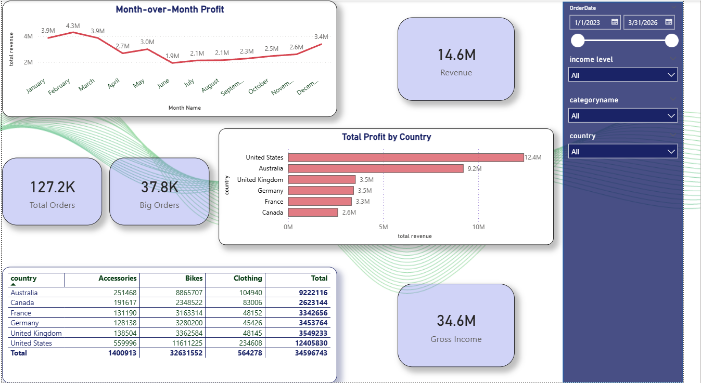
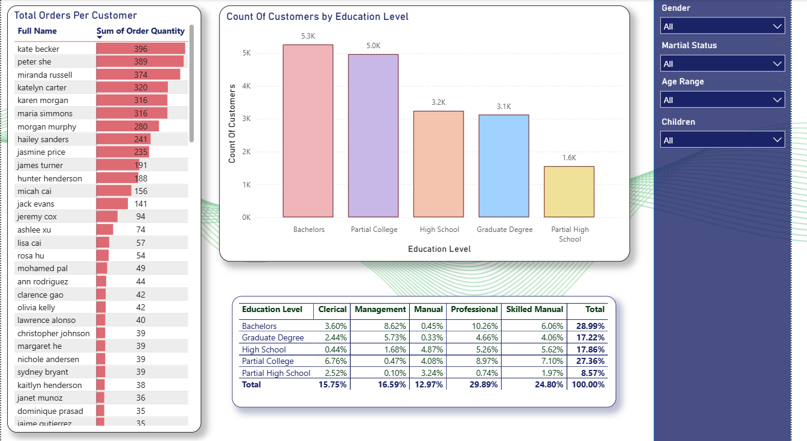
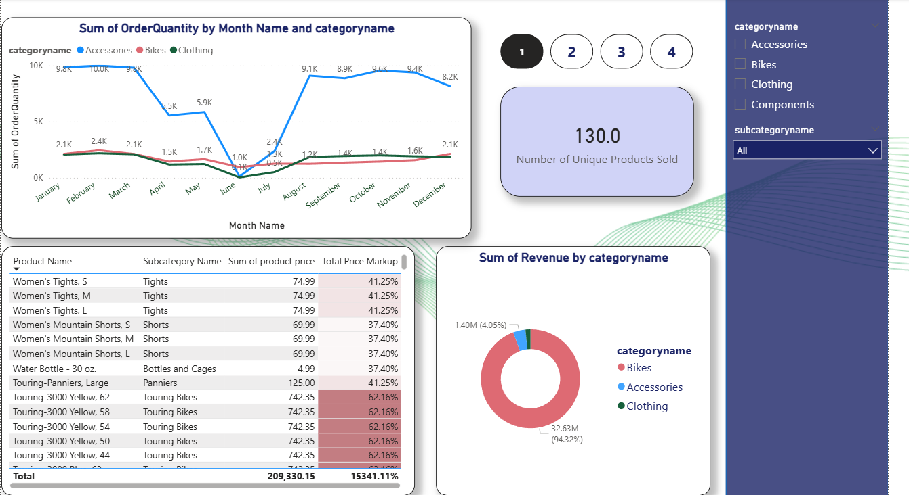

# Online Shopping Sales Dashboard 🛍️ | Power BI

## Overview
Interactive 3-page Power BI dashboard analyzing sales performance, 
product trends, and customer behavior across 6 countries (2023–2026).

## Tools
Power BI Desktop, DAX

## Dashboard Pages
- **Sales Performance** — Revenue, profit trends, and country breakdown
- **Product Analysis** — Order trends, pricing, and revenue by category
- **Customer Insights** — Demographics, education level, and top customers

## Key Findings
- US is the top market with $12.4M in profit
- 127.2K total orders | $34.6M gross income
- Bachelors degree holders are the largest customer segment

## Dashboard Preview

